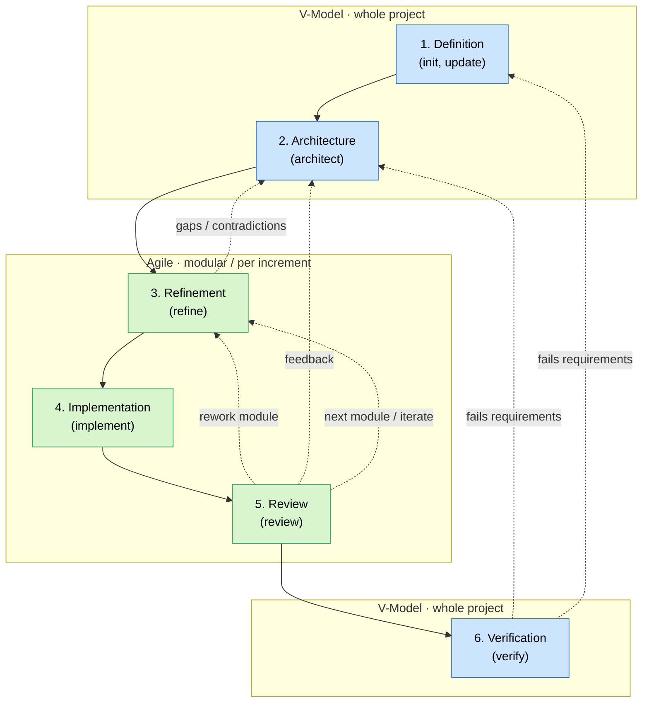

### General Rules
- Communication and files should be short and concise because they are processed by AI.
  - Use bullet points instead of long paragraphs.
  - Use mermaid diagrams as much as possible - pictures tell more than words
- Do not explain everything, expect professional knowledge
- Reference content instead of writing it again
- For diagrams use "mermaid" in markdown
- Always ask for clarification if you are not sure about something. Do not make assumptions.

### Artifact Hygiene
- Treat generated project artifacts as living source-of-truth documents, not historical logs.
- During every update, remove or replace content that is no longer true:
  - outdated decisions,
  - invalid assumptions,
  - abandoned or rejected features,
  - obsolete implementation plans,
  - duplicate explanations already owned by another artifact.
- Keep content that is still actionable:
  - active requirements,
  - current architecture,
  - current implementation plan,
  - open questions,
  - known risks,
  - test/verification evidence.
- If information may still be relevant but is unclear, do not delete it silently. Ask the user or mark it as `open / needs validation`.
- Prefer short bullets, references and Mermaid diagrams over repeated prose.

### Constraints
- Never change files outside of this repository
- Use git only for read-only actions

### Documents and Folders
- copilot/context.md: This document gives a high-level overview of the project and its target, defines its functionality and how the LLM should interact/work/behave. It defines the basic solution space, e.g. tech stack and quality requirements. The appendix contains glossary and abbreviation definitions.
- copilot/architecture.md: This document contains the current software architecture. It defines the components, their functionality and their interfaces. It also contains flowcharts and diagrams to explain the architecture.
- copilot/refinement.md: This document defines how to implement the software architecture. Split up into components.
- copilot/tickets: This folder contains all generated tickets and a kanban overview.
- copilot/review.md: This document contains the review of the current state of the software. It defines problems, bugs, gaps and contradicting information in the software. It also contains suggestions for improvements and changes to the architecture and refinement.
- copilot/verify.md: This document contains the final verification result. It defines how well the software meets the requirements and how well it follows the architecture and refinement. It also contains suggestions for improvements and changes to the architecture and refinement.
- copilot/analysis.md: This document contains the analysis of the legacy code.

Always load the context file before starting to process information. It is the basis for understanding your work and the project.

### Software Development Lifecycle - SDLC
This project follows the VAgile process. It is a combination of the traditional V-Model and the Agile process. The macro part of the project (beginning and end) follows the V-Model, while the micro part (Refinement/Implementation/Review) follows an agile methodology.
1. Definition (V-Model - whole project): In this phase the requirements and the architecture are defined. The context document is created and the architecture document is created. (init and update skill)
2. Architecture (V-Model - whole project): In this phase the architecture is defined and refined. The architecture document is created and updated. Functions are grouped in components and interfaces are defined. (architect skill)
3. Refinement (Agile - part): In this phase the implementation of the architecture is defined in tickets. The refinement document is created and updated. The implementation is split into modules/units. (refine skill)
4. Implementation (Agile - part): Tickets are implemented . (implement skill)
5. Review (Agile - part): The software is reviewed and feedback is given. The review document is created and updated. Problems, bugs, gaps and contradicting information are defined. Suggestions for improvements and changes to the architecture and refinement are given. (review skill)
6. Verification (V-Model - whole project): The software is verified against the requirements and the architecture. The verify document is created and updated. The final verification result is defined. (verify skill)

#### VAgile Process Flow

