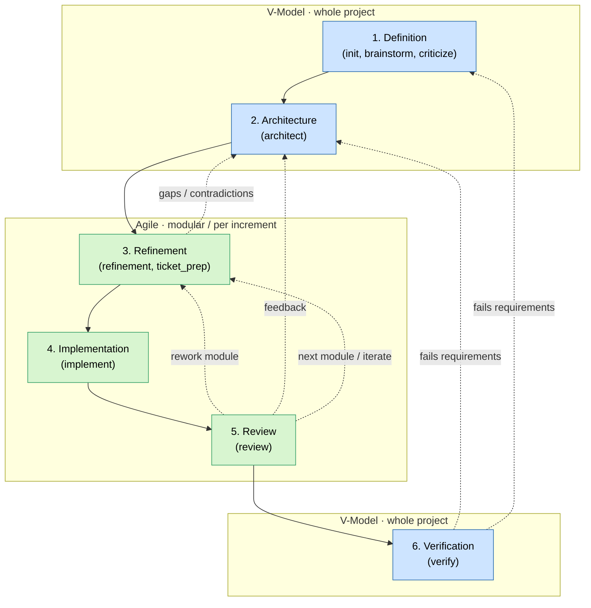

### General Rules

- Communication can be nearly skipped as most of the information is in the documents.
  - Keep the final answer to the minimum, do not explain anything just write notes what was done.
- files should be short and concise because they are processed by AI.
  - Use bullet points instead of long paragraphs.
  - Use mermaid diagrams as much as possible - pictures tell more than words
- Do not explain everything, expect professional knowledge. But always explain referenced tools / and libraries in one short sentence
- Reference content instead of writing it again
- For diagrams use "mermaid" in markdown
- Always ask for clarification if you are not sure about something. Do not make assumptions.
- Keep your answer short, communicate in the documents/files

### Constraints
- Never change files outside of this repository
- Use git only for read-only actions

### Software Development Lifecycle - SDLC
This project follows the VAgile process. It is a combination of the traditional V-Model and the Agile process. The macro part of the project (beginning and end) follows the V-Model, while the micro part (Refinement/Implementation/Review) follows an agile methodology.
1. Definition (V-Model - whole project): In this phase the project context and software requirements are defined. `context.md`, `software_requirements.md` are created. (init, brainstorm, criticize skill)
2. Architecture (V-Model - whole project): In this phase the `architecture.md` is defined and created from `context.md` and `software_requirements.md`. Functions are grouped in components and interfaces are defined. (architect skill)
3. Refinement (Agile - part): In this phase the implementation/design of each *component is defined. For each component modules and units are defined. As well as data handling, interfaces and so on. So the code can be completely derived from these documents. Executed component for component. (refine, ticket_prep skill)
4. Implementation (Agile - part): Tickets are implemented . (implement skill)
5. Review (Agile - part): One slice is reviewed and feedback is given. The review document is created and updated. Problems, bugs, gaps and contradicting information are defined. Suggestions for improvements and changes to the architecture and refinement are given. (review skill)
6. Verification (V-Model - whole project): The software is verified against `software_requirements.md`, `context.md` and the architecture. The verify document is created and updated. The final verification result is defined. (verify skill)

#### VAgile Process Flow

### Documents and Folders
- ``copilot/context.md``: High-level project brief and operating context for LLM work. Contains project description, tech stack, quality/test requirements, file structure, appendix, glossary and abbreviations. It must not contain the detailed software requirements chapter.
- ``copilot/software_requirements.md``: Product and software requirements source of truth.
- ``copilot/architecture.md``: This document contains the current software architecture. It defines the components, their functionality and their interfaces. It also contains flowcharts and diagrams to explain the architecture.
- ``copilot/refinement/component_*.md``: These documents define how to implement the software architecture. Each component has its own document.
- ``copilot/refinement/interface_*.md``: These documents define how to implement the software architecture. Main interfaces have their own document.
- ``copilot/tickets/####.md``: This folder contains all generated tickets and a kanban overview.
- ``copilot/review/review_*.md``: These documents contain the review of the current state of the software. It defines problems, bugs, gaps and contradicting information in the software. It also contains suggestions for improvements and changes to the architecture and refinement.
- ``copilot/verify.md``: This document contains the final verification result. It defines how well the software meets the requirements and how well it follows the architecture and refinement. It also contains suggestions for improvements and changes to the architecture and refinement.
- ``copilot/analysis.md``: This document contains the analysis of the legacy code.
- ``scripts/kanban.py``: This script generates a kanban overview of all tickets in the `copilot/tickets/kanban.md` file.

# Always load `copilot/context.md` and `copilot/software_requirements.md` before starting to process information.

### Artifact Hygiene
- Treat generated project artifacts as living source-of-truth documents, not historical logs.
- During every update, remove or replace content that is no longer true:
  - outdated decisions,
  - invalid assumptions,
  - abandoned or rejected features,
  - obsolete implementation plans,
  - duplicate explanations already owned by another artifact. .
- If information may still be relevant but is unclear, do not delete it silently. Ask the user or mark it as `open / needs validation`.

###  Glossary
- Software Design: Defines components, their included functionality and the interfaces.
- Software Architecture: Defines the implementation of all modules, units of a component in detail (i.e. mostly class diagrams)
- Component: Highest level of abstraction of functionality. A component can be divided into sub-components and sub-sub-components if needed, but this is only for extremely big projects. A component contains modules and the component unit (named after the component). Components are not necessarily software-relevant; they are groups of functionality. (I.e. component "User Management" could contain module "Authentication", which contains units "WebDav", "OAuth", "LDAP" and so on.)
- Module: Groups units that belong together and share common interfaces. A module can also have a unit that is named after the module.
- Unit: A unit is a .h and a .c/cpp file that mostly contains a class.
- Interface: An interface are the functions that are needed to interact with a Component/Module/Unit. Interfaces can be functions of a class, an abstract/virtual class and even static global functions. But they also can be protocols or files.
- Message: An message is a part of an interface this can be one message of a protocol
- Field: An field is a part of a Message.
- Argument: An argument is a part of a function.
- Vertical Slicing: Implementing the software by slices. Each slice is a vertical through the architecture, implementing one feature so the user can test and give feedback early on.
- Slice: A slice is a group of connected functions through the architecture for a small amount of features in full functionality. (i.e. First Slice: buildsystem, Second Slice: Setup assistant, Third Slice: Settings management, and so on.)
- Test driven development (TDD): First implement tests that will cover all functionality that is followed to implement.
- Regression testing: Execute all tests after each change. There have to be tests for all functions and all occurred bugs in place, so this is possible.
- Technical debt: Tasks that are not related to project functionality but aim for general improvements, i.e. refactoring, improving the architecture, improving the process, and so on.