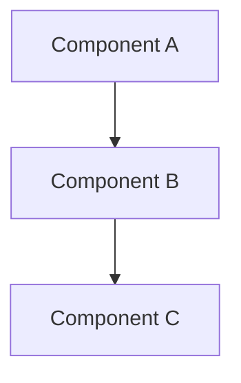

# Analysis

> Generated by the `analyse` skill (LegacyCode). Reverse-engineered from existing code.
> Describes what *is*, not what *should be*. Short, bullet points, mermaid over prose.

## 1. Architecture
- Reconstructed components, responsibilities and interfaces.

- Per component: modules, units, key classes.
- Interfaces table:

| Interface | Provider | Consumer | Purpose |
|-----------|----------|----------|---------|
| <name> | <component> | <component> | <purpose> |

- Key flows as sequence diagrams where helpful.

## 2. Code Quality
- Smells, risks, dead code, coupling, duplication.
- Missing/weak tests, build/lint state.
- Use concrete examples: `path/file:line` + short note.

## 3. Identified Gaps and Problems
- Functional gaps vs. `context.md`.
- Architecture/code mismatches and contradictions.
- Risks ranked by severity (High / Medium / Low).
- Hand-off: which items should become `debt_####` tickets (`refinement`) or drive a `redesign`.

