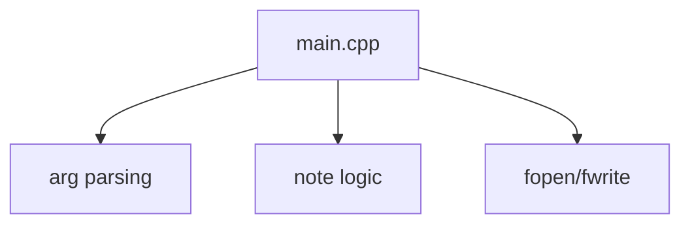
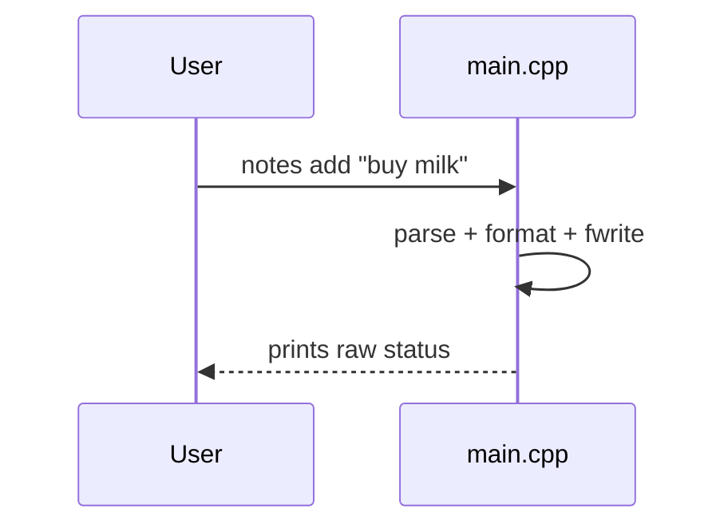

# Analysis

> Example: legacy CLI note-taking app.

## 1. Architecture
- Single `main.cpp` mixes argument parsing, business logic and file I/O.

- No clear components; everything global in `main.cpp`.
- Interfaces:

| Interface | Provider | Consumer | Purpose |
|-----------|----------|----------|---------|
| (none) | main.cpp | main.cpp | all logic inline |

## 2. Code Quality
- `main.cpp:1` – 600-line `main()`, no functions extracted.
- `main.cpp:210` – duplicated file-path building in 4 places.
- No tests at all; no clang-format/clang-tidy config.
- `fopen` results unchecked → crashes on missing dir.
- Global mutable `char buf[256]` reused everywhere (buffer risk).

## 3. Identified Gaps and Problems
- High: no error handling for I/O, app crashes on corrupt file.
- High: zero test coverage.
- Medium: no separation of concerns (CLI vs core vs storage).
- Low: inconsistent naming (`addNote` vs `do_list`).
- Hand-off:
  - `redesign` → target components CLI / NoteCore / Storage.
  - `dept_0001` extract storage, `dept_0002` add I/O error handling.

