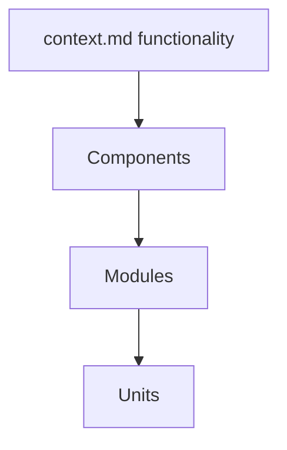

input: copilot/context.md
output: copilot/architecture.md

# Goal
- SDLC phase 2 (Architecture, V-Model). Interactive.
- Translate functionality from `context.md` into a component-based architecture.
- Greenfield: from `context.md`. Legacy: use `analyse` + `redesign` instead.

# Phase 1 - Load
- Always load `copilot/context.md` first (targets, functionality, tech stack, quality).

# Phase 2 - Group functionality
- Group functions into Components (see context.md glossary) - if to big you can creat sub-components and so on.
- Define interfaces between them (in case of protocols or header classes).

# Phase 3 - Discuss with user
- Ask the user open questions to widen the solution space. Discuss with the user question by question refine ideas and generate new ones. Do not ask all questions at once, but one by one, discuss each question and its answer before moving to the next one. Every few questions ask the user if he wants to progress to phase 4 or if he wants to continue refining the architecture with more questions.

# Phase 4 - Write architecture.md
- Use `architecture.default.md` (this folder) as template; see `architecture.example.md`.
- Keep interfaces explicit.

