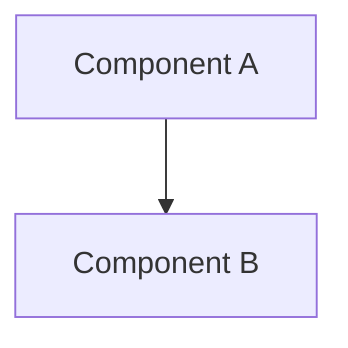
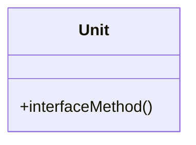
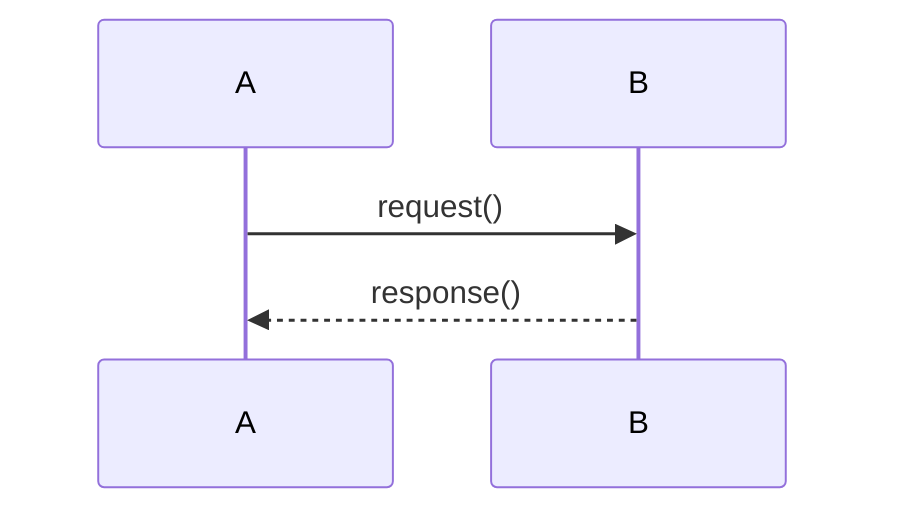

# Software Architecture

> Generated by the `architect` skill from `copilot/context.md`.
> Short and concise. Prefer mermaid over prose.

## 1. Overview
- One-line purpose.
- High-level component diagram.

## 2. Components
For each component repeat:

### <Component Name>
- Responsibility: <what it does>
- Modules: <list>
- Interfaces: <provided / required>

## 3. Module / Unit detail
- Per module: units, responsibilities, key classes.

## 4. Interfaces
- Table of interface: provider -> consumer, signature, purpose.

## 5. Data / Flow
- Key flows as sequence diagrams.

## 6. Cross-cutting
- Error handling, logging, config, security.

## 7. Open questions
- Bullet list.

