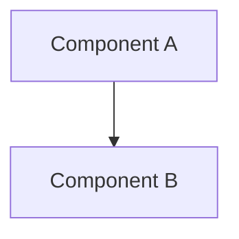
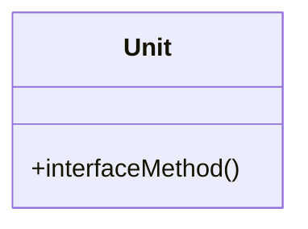
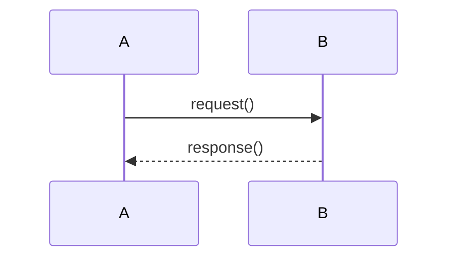

# PROJECT_NAME - Software Requirements

## Overview
- Very short overview of purpose and functionality of the software. One or two sentences.
- High-level component diagram.

## Components
For each component repeat:

### <Component Name>
- Responsibility: <what it does>

#### Interface
- <provided / required>

## Data / Flow
- Key flows as sequence diagrams.

