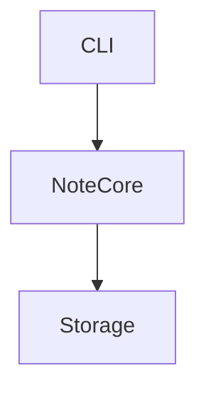
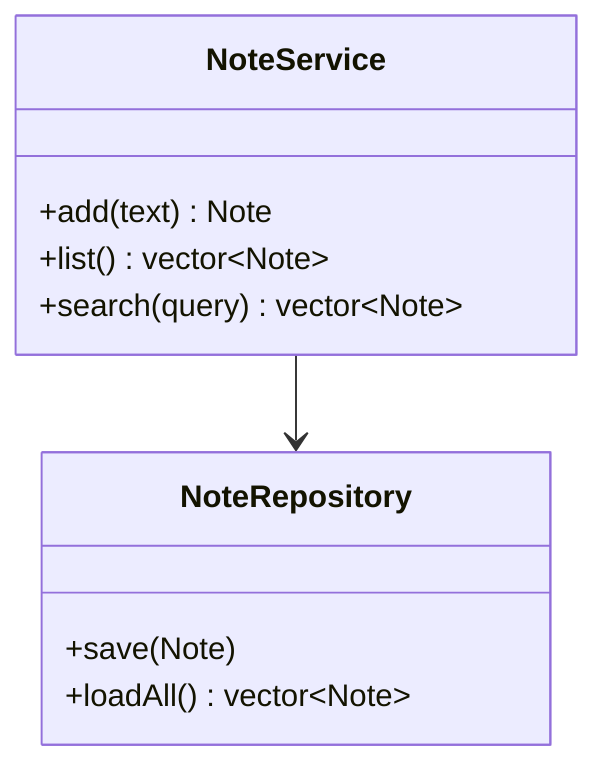
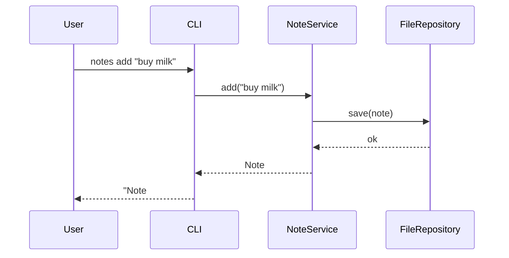

# Software Architecture

> Example: simple CLI note-taking app (C++20).

## 1. Overview
- Store, list and search plain-text notes from the command line.

## 2. Components

### CLI
- Responsibility: parse args, render output.
- Modules: ArgParser, Renderer
- Interfaces: required `NoteService`

### NoteCore
- Responsibility: business logic for notes.
- Modules: NoteService, Search
- Interfaces: provided `NoteService`; required `NoteRepository`

### Storage
- Responsibility: persist notes on disk.
- Modules: FileRepository
- Interfaces: provided `NoteRepository`

## 4. Interfaces
| Interface | Provider | Consumer | Purpose |
|-----------|----------|----------|---------|
| NoteService | NoteCore | CLI | note operations |
| NoteRepository | Storage | NoteCore | persistence |

## 5. Data / Flow

## 6. Cross-cutting
- Errors: exceptions mapped to exit codes.
- Config: notes dir via `NOTES_DIR` env var.

## 7. Open questions
- Encryption needed? (TBD)

