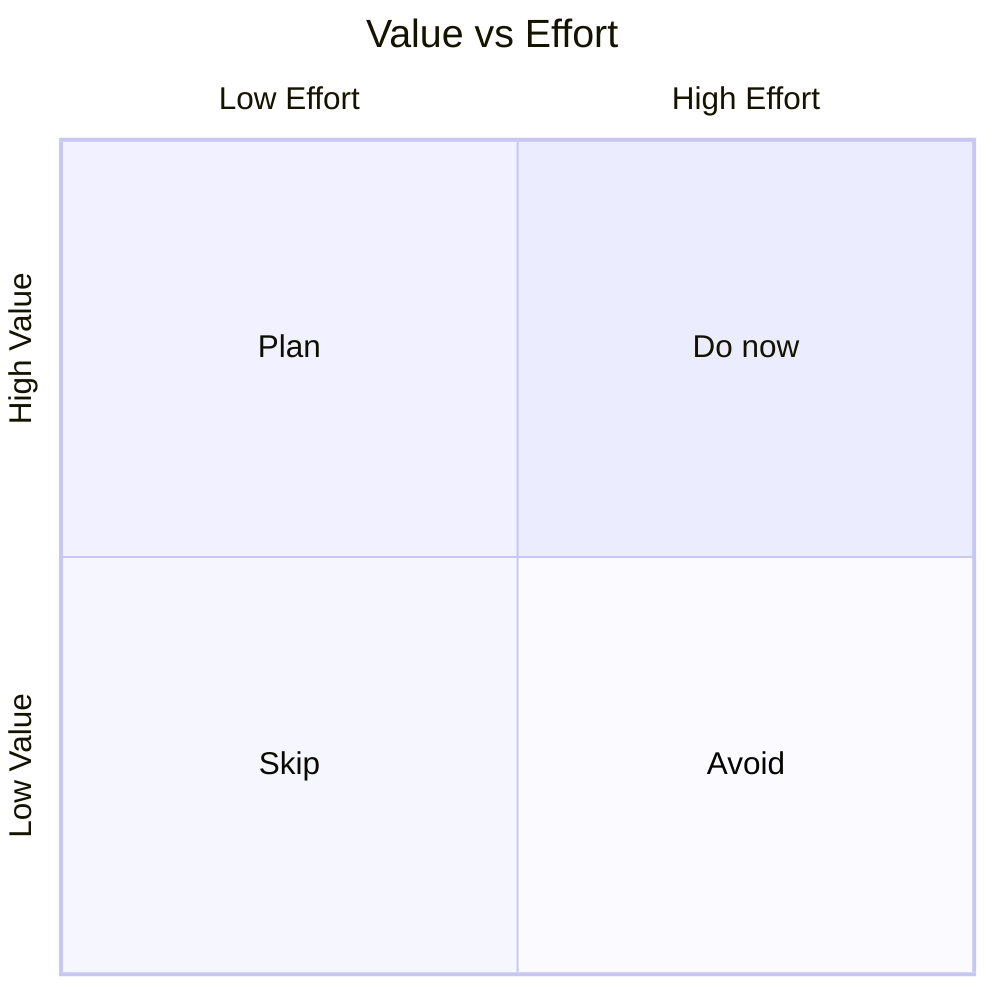

# Phase 1 - Load
- Load `copilot/context.md` and `copilot/software_requirements.md` from the target project for targets, state, constraints and product behavior.

# Phase 2 - Diverge
- Propose multiple ideas like a storm (features, approaches, simplifications).
- Challenge assumptions, offer alternatives.
- Ask the user open questions to widen the solution space. Do not ask all questions at once, but one by one, discuss each question and its answer before moving to the next one. Every few questions ask the user if he wants to progress to phase 3 or if he wants to continue brainstorming with more questions.

# Phase 3 - Converge
- Cluster ideas, rate by value vs. effort.
- Let the user pick what to keep. Simple by questions for each idea: Do not ask the user to pick between ideas, but ask for each idea if he wants to keep it or not. Do not ask the user to rate ideas by value vs effort, but do it yourself based on the discussion with the user and your understanding of the project. Add it to the question like this  "Do you want to keep this idea? Effort: x/10 Value: x/10; yes/no/optional user input".
- Then progress to phase 4 with the selected ideas.

# Phase 4 - Apply
- Ask the user to either
    - Update `copilot/context.md` / `copilot/software_requirements.md` in the target project with validated state, open issues and ideas.
    - Fix the findings directly
- Do not update unvalidated/undiscussed findings.

