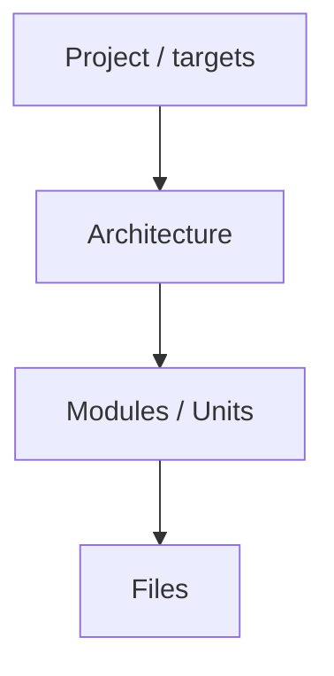

# Goal
- Find weaknesses top-down: project -> architecture -> files.

# Phase 1 - Load
- Load `copilot/context.md` from the target project, `copilot/architecture.md` if present, and the parts of the codebase the user requested.

# Phase 2 - Criticize (top-down)

For each level collect:
- Problems, risks, gaps, contradictions.
- Overengineering / duplication / dead parts.
- Missing tests or quality gates.

# Phase 3 - Discuss
- Discuss withe the user each all found points if they are  valid and what they think about them. Do not assume. Discuss with the user question by question and refine the problems. Do not ask all questions at once. Discuss each critique and its answer before moving to the next one. Every few questions ask the user if they want to progress to phase 4 or continue discussing more collected critiques.

# Phase 4 - Apply
- Ask the user to either
  - Update `copilot/context.md` in the target project with validated state, open issues and ideas.
  - Fix the findings directly
- Do not update unvalidated/undiscussed findings.

