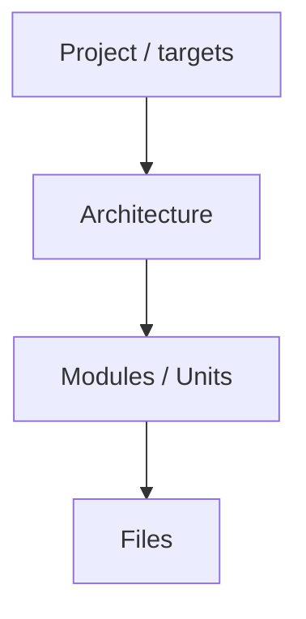

basic file: copilot/context.md

# Goal
- Find weaknesses top-down: project -> architecture -> files.

# Phase 1 - Load
- Load `copilot/context.md` (and `architecture.md` if present) as well as the parts of the codebase the user requested.

# Phase 2 - Criticize (top-down)

For each level collect:
- Problems, risks, gaps, contradictions.
- Overengineering / duplication / dead parts.
- Missing tests or quality gates.

# Phase 3 - Discuss
- Present findings ranked by severity.
- Ask the user which points are valid. Do not assume. Discuss with the user question by question refine the problems. Do not ask all questions at once, but one by one, discuss each critic and its answer before moving to the next one. Every few questions ask the user if he wants to progress to phase 4 or if he wants to continue discussing more critics that where collected.

# Phase 4 - Apply
- Update `context.md` (state, open issues, ideas).
- For code-level problems hand over to the `review` skill if needed.

