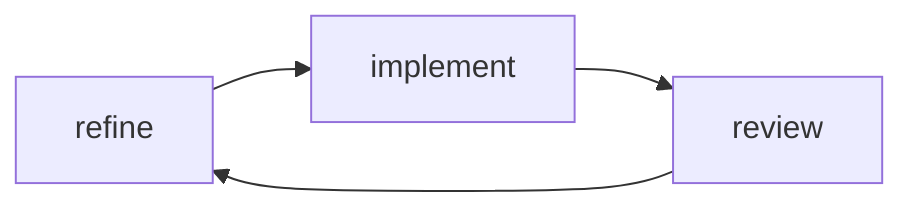
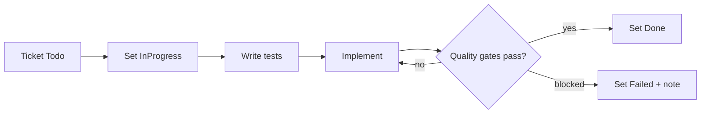

input: copilot/tickets/####.md

# Goal
- SDLC phase 4 (Implementation, Agile). Non-interactive: do not ask, follow the documents.
- Implement open tickets, code + tests, until quality gates pass.

# Phase 1 - Load
- Always load `copilot/context.md` first, then `architecture.md`, `refinement.md`.
- implement given ticket. If not ticket was given look for the lowest not done ticket.

# Phase 2 - Implement (per ticket)

- Follow TDD: write tests from the ticket first.
- Reuse code, keep it small and simple (context.md rules).

# Phase 3 - Verify gates
- per `context.md` III/V
- Fix failures before finishing. If unfixable: set ticket `Failed` + note reason.

# Phase 4 - Update board
- Run `scripts/kanban.py` if present.
