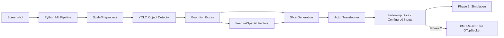
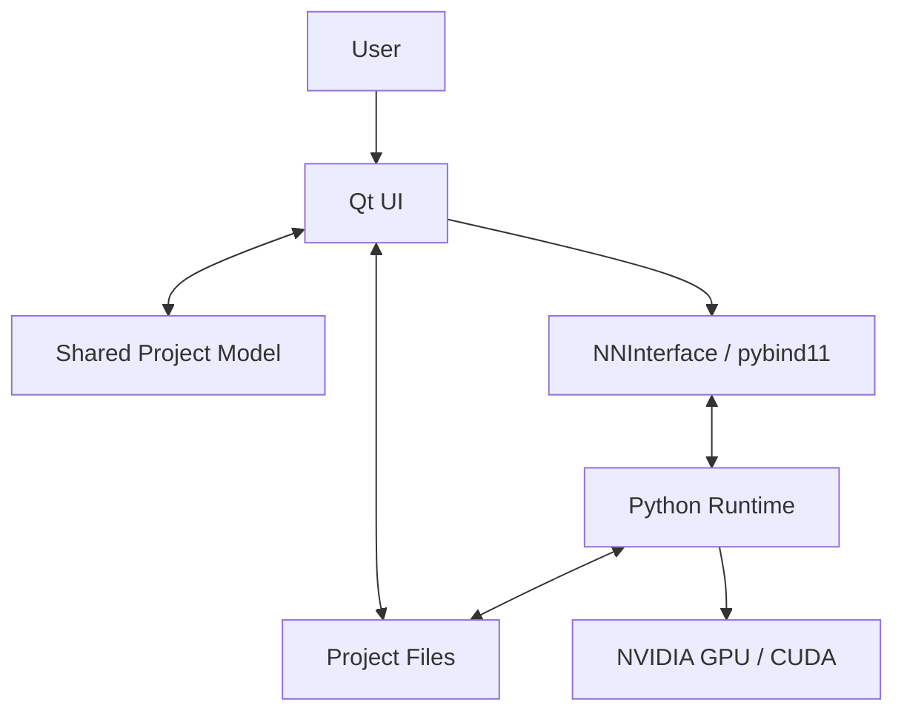
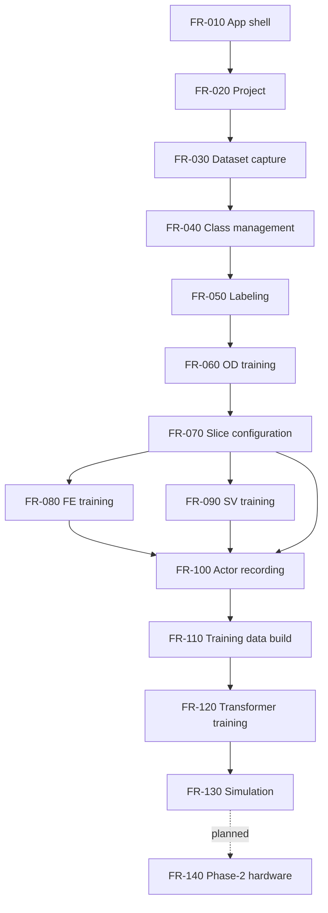

# Helpi2 - Context

## I. Project description
- Helpi2 is a local desktop toolchain for creating, labeling, training and evaluating a model-complex that can imitate user input sequences from visual game/application state.
- Primary domain examples: OSRS, Minecraft and similar visual-interaction environments.
- Phase 1 target: simulation-only inference pipeline.
- Phase 2 target: optional XMCRelaxKit integration via `QTcpSocket`; the external device simulates USB inputs. The interface is not yet defined.
- Boundary: use only in owned/local/test environments and respect legal, safety and platform rules.



## II. Tech stack
- C++17 configured in `CMakeLists.txt`.
- Qt 6 Widgets (`QT_ROOT_DIR` currently points to `C:/Qt/6.10.2/msvc2022_64`).
- CMake + CTest; MSVC/Visual Studio build folders exist.
- pybind11 embedded Python bridge.
- Python ML stack:
    - `ultralytics`, `torch`, `torchvision`, `opencv-python`, `Pillow`, `dxcam`, `pynput`.
- GoogleTest via CMake `FetchContent`.
- Target OS: Windows; NVIDIA GPU/CUDA expected, CPU fallback optional.

## III. Quality requirements
- Be honest about current state; do not document aspirational quality as done.
- Before finishing implementation tickets:
    - build all relevant CMake targets,
    - run CTest / GoogleTest,
    - run clang-format and clang-tidy when available,
    - fix failures or document blockers.
- Maintainability:
    - small, simple solutions,
    - no duplicate logic,
    - clear ownership between UI, project model, pybind bridge and Python ML modules.
- Runtime target:
    - full calculation path should be `<100 ms` on NVIDIA GPU target hardware,
    - CPU fallback is optional and may be slower.
- Safety/product limits:
    - Phase 1 is simulation-only.
    - Phase 2 hardware automation is planned but its socket protocol and safety behavior are open.

## IV. Overview of filestructure
- `src/main.cpp`: Qt application entrypoint.
- `src/ui/`: main window and Qt UI files.
- `src/ui/apps/`: workflow tabs:
    - `Project`: project selection/config,
    - `Dataset`: screenshots, statistics, previews,
    - `Labeling`: bounding-box labeling/generation,
    - `ODTraining`: YOLO training/preview,
    - `SlicePreparation`: slice/key/model configuration,
    - `NNTraining`: recording and Actor Transformer training,
    - `Action`: inference/simulation; Soft/Hard modes not complete.
- `src/ui/elements/`: reusable widgets/trainers.
- `src/nn/`: `NNInterface` pybind11 bridge to Python.
- `src/python/`: ML/runtime modules:
    - `objectdetector.py`, `featureextractor.py`, `specialvector.py`,
    - `slicegenerator.py`, `actortransformer.py`, `actor.py`, `recorder.py`.
- `src/utils/`: shared model/state and utilities.
- `tests/`: GoogleTest tests; currently only `ModelTest.cpp`.
- `copilot/`: generated planning/review/context documents.
- `cmake-build-*`: local build outputs; not architecture source.

## V. Test requirements
- C++:
    - GoogleTest is mandatory for new C++ behavior.
    - Add regression tests for every fixed bug where feasible.
- Python:
    - No Python test framework is currently configured.
    - Add Python tests when refactoring ML/data transformation logic.
- Coverage priorities:
    - project model/path handling,
    - slice settings serialization/deserialization,
    - label and dataset edge cases,
    - pybind input/output conversion boundaries,
    - Actor Transformer data shaping and prediction output format.
- Current gap:
    - tests are largely missing compared to project complexity.

## VI. Context

### VI.1 Software Requirements Specification scope
- This section is the functional source of truth for architecture, refinement and tickets.
- Terms:
    - **System**: Helpi2 desktop application plus embedded Python ML runtime.
    - **Project**: one local training workspace with dataset, labels, models, slice settings, recordings and training outputs.
    - **Model-complex**: OD + optional FE/SV encoders + SliceGenerator + ActorTransformer.
- Current release target:
    - **Phase 1**: end-to-end simulation pipeline.
    - **Phase 2**: hardware output via XMCRelaxKit over `QTcpSocket`; protocol open.
- Out of scope until explicitly specified:
    - cloud storage/sync,
    - multi-user collaboration,
    - automatic dataset quality scoring,
    - production-grade deployment installer,
    - Phase-2 hardware protocol details.



### VI.2 Actors and operating assumptions
- Primary actor: local user creating/training/evaluating a behavior-imitation model.
- Target environments:
    - local Windows desktop,
    - visual-interaction domains such as OSRS or Minecraft,
    - NVIDIA GPU expected for practical performance.
- Safety assumptions:
    - Phase 1 does not emit real input actions.
    - Phase 2 must require an explicit hardware configuration and safe start/stop behavior.
    - Generated inputs must only be used in environments where the user is allowed to do so.

### VI.3 End-to-end product workflow


### VI.4 Project storage requirements
- `FR-001` The system shall store all user-generated project artifacts locally.
- `FR-002` The system shall create one project root below the configured dataset base path.
- `FR-003` A project shall contain at least:
    - `project.ini`: project comment and base model metadata,
    - `odmodels/images`: OD dataset screenshots,
    - `odmodels/labels`: YOLO label files,
    - `odmodels/model_settings.yaml`: YOLO dataset/class config,
    - `odmodels/savefile.pt`: object detector model,
    - `odmodels/tmptrain`: generated YOLO train/validation split,
    - `odmodels/slice_settings.ini`: slice and actor-output configuration,
    - `odmodels/recordings`: actor training recordings,
    - `odmodels/train_data.bin`: generated flat training data,
    - `odmodels/train_meta.json`: generated recording metadata,
    - `odmodels/transformer.pt`: ActorTransformer model,
    - `nnmodels`: reserved current/legacy NN storage path,
    - `FeatureExtractor/Models/<name>/model.pt`: FE models,
    - `SpecialVector/Models/<name>/model.pt`: SV models.
- `FR-004` The system shall not require committing datasets, recordings or model weights.

### VI.5 Functional requirements

#### FR-010 Application shell and navigation
- Purpose: provide a single maximized Qt desktop application with workflow tabs.
- Inputs:
    - user clicks toolbar buttons,
    - shared `Model::Valid()` state.
- Processing:
    - hide the tab bar,
    - expose workflow tabs through tool buttons,
    - enable all non-project tabs only when a project is valid.
- Outputs:
    - active tab receives focus and `SetActive()`.
- Acceptance:
    - with no valid project only project selection is enabled,
    - after project selection Dataset, Labeling, ODTraining, SlicePreparation, NNTraining and Action become enabled.

#### FR-020 Project management
- Purpose: create, select, list and delete local projects.
- Inputs:
    - project name,
    - optional comment,
    - base YOLO model name/path.
- Processing:
    - list directories under the dataset base path,
    - show an `Add...` entry,
    - create project folders,
    - create `model_settings.yaml`,
    - persist metadata in `project.ini`,
    - initialize OD model through `NNInterface::Create`,
    - update shared `Model` paths.
- Outputs:
    - valid project model with project/images/labels/yaml/model/training paths,
    - generated OD model file.
- Acceptance:
    - selecting a project loads all required paths into the shared model,
    - creating a project creates all base folders and YAML file,
    - deleting a project asks for confirmation.
- Open/known gap:
    - project base path is currently hardcoded in `Global::Model::cProjectDatasetBasePath`.

#### FR-030 Dataset overview and screenshot capture
- Purpose: inspect the OD image dataset and capture new screenshots.
- Inputs:
    - current project paths,
    - screenshot trigger key `#`,
    - current screen image from Recorder.
- Processing:
    - scan supported image extensions: `.png`, `.jpg`, `.jpeg`, `.webp`, `.bmp`,
    - scan label files,
    - calculate labeled/unlabeled counts,
    - count labels per class from YOLO label files,
    - render image thumbnails,
    - filter thumbnails by none/unlabeled/labeled,
    - start Recorder when screenshot mode is active,
    - poll pressed characters every 50 ms,
    - on `#`, save `img_<000000>.jpg` to `odmodels/images`.
- Outputs:
    - progress bar,
    - statistics panel,
    - thumbnail grid,
    - captured JPEG screenshots.
- Acceptance:
    - each captured image appears in the grid without restart,
    - clicking a thumbnail asks for deletion and removes its label file too,
    - filter cycles through `none -> Unlabeled -> Labeled -> none`.

#### FR-040 Class management
- Purpose: maintain YOLO classes stored in `model_settings.yaml`.
- Inputs:
    - YAML class list,
    - new class name,
    - delete-class command.
- Processing:
    - parse classes after `names:`,
    - render class list with deterministic colors,
    - append classes as `index: name`,
    - emit selected class name/color/index,
    - delete classes with confirmation,
    - rewrite YAML class indices,
    - remove labels for deleted class,
    - decrement larger class indices in all label files in dataset and tmptrain label folders.
- Outputs:
    - updated YAML,
    - updated YOLO label files,
    - `SelectionChanged` and `ClassDeleted` events.
- Acceptance:
    - class deletion cannot leave stale class IDs for higher-index classes,
    - label views refresh after deletion.

#### FR-050 Labeling editor
- Purpose: manually create, edit, delete and auto-generate YOLO labels.
- Inputs:
    - dataset image,
    - matching label file path,
    - current class selection,
    - mouse/keyboard operations,
    - OD prediction confidence.
- Processing:
    - navigate previous/next image,
    - navigate previous/next unlabeled image,
    - support shortcuts:
        - Left/Right: previous/next image,
        - PageDown/PageUp: previous/next unlabeled,
        - Minus/Plus: zoom,
        - Backspace: reset zoom,
        - `1`: mouse/drag mode,
        - `2`: bounding-box mode,
        - `3`: edit mode,
    - display image with overlaid labels,
    - draw a new box in bounding-box mode,
    - write labels as normalized YOLO values: `class x_center y_center width height`,
    - edit labels by moving/resizing boxes,
    - delete highlighted labels,
    - generate labels from current OD model via `NNInterface::Predict` and append boxes.
- Outputs:
    - updated `.txt` label files,
    - visual labels with class colors/text,
    - generated OD-based proposals.
- Acceptance:
    - labels persist immediately in YOLO format,
    - generated boxes use the selected confidence threshold,
    - zoom/edit operations keep label coordinates aligned to the image.
- Known gap:
    - some unlabeled-navigation edge cases should be regression-tested.

#### FR-060 Object Detector training and preview
- Purpose: train and evaluate the YOLO OD model for project classes.
- Inputs:
    - labeled images,
    - unlabeled background images,
    - validation slider count,
    - background slider count,
    - epoch count,
    - augmentation flag,
    - reset flag,
    - confidence threshold for preview.
- Processing:
    - refresh image list and label counts on tab activation,
    - rebuild `tmptrain` folder,
    - randomly shuffle labeled files,
    - copy selected validation labels/images to validation set,
    - copy remaining labeled labels/images to train set,
    - copy selected unlabeled images as background examples,
    - optionally reset model from base model,
    - call Python `objectdetector.train`,
    - save best model back to `savefile.pt`,
    - preview detections on one selected image.
- Outputs:
    - trained YOLO model,
    - console/debug training output,
    - `preview_labels.txt`,
    - preview overlay.
- Acceptance:
    - training button is disabled during training,
    - preview requires valid project and selected image,
    - preview logs count and raw detections.
- Known gap:
    - training currently blocks UI except manual `processEvents` usage.

#### FR-070 Slice configuration
- Purpose: define how OD detections become per-frame numeric input slices and which input states are predicted.
- Inputs:
    - class list from YAML,
    - per-class mode,
    - per-class count/feature/input/split settings,
    - shared FE/SV model names,
    - configured key/mouse outputs,
    - slice count,
    - recording/inference frequency.
- Per-class modes:
    - `Limit Count to`: keep up to `count` detections as bounding-box floats,
    - `Transform to Feature Vector`: encode crop through FE model,
    - `Special Vector`: encode crop through supervised SV model,
    - `Split up into multiple feature vector`: resize crop into a tile grid and encode each tile,
    - `Ignore`: class contributes zero floats.
- Supported actor outputs:
    - `A-Z`, `0-9`, `F1-F12`, `CTRL`, `ALT`, `SHIFT`, `TAB`, `ENTER`,
    - `Left Mouse`, `Right Mouse`, `Middle Mouse`,
    - `Scroll Up`, `Scroll Down`,
    - `Mouse Pos x`, `Mouse Pos y`.
- Processing:
    - build class rows dynamically,
    - build key rows dynamically,
    - create shared FE/SV model names,
    - create trainer tabs for classes requiring FE/SV,
    - synchronize read-only class row values from trainer settings,
    - calculate per-class floats,
    - calculate `sliceSize`, total tensor size and data rate,
    - persist settings in `slice_settings.ini`.
- Outputs:
    - `slice_settings.ini`,
    - derived JSON settings for Python consumers in NNTraining/Action,
    - trainer tabs.
- Acceptance:
    - changing any mode/count/key/frequency updates totals and saves settings,
    - FE/SV modes expose model selection and trainer tab,
    - `Ignore` contributes `0` floats,
    - split float count equals `splitL * splitH * splitSize`,
    - total tensor size equals `inputFloats * sliceCount + outputFloats`.

#### FR-080 Feature Extractor training
- Purpose: train unsupervised autoencoder encoders for OD crops/tiles.
- Inputs:
    - screenshots captured in the FE trainer,
    - OD model path,
    - class ID,
    - feature size,
    - input size,
    - tile columns/rows,
    - epochs,
    - batch size,
    - learning rate,
    - OD confidence.
- Processing:
    - capture images via Recorder and `#` trigger,
    - preview/delete captured images,
    - run OD on source images,
    - crop detections for the configured class,
    - resize crop to `tileCols * inputSize` by `tileRows * inputSize`,
    - split crop into `inputSize x inputSize` tiles,
    - train autoencoder reconstruction model,
    - save encoder/checkpoint to the selected model path,
    - emit settings changes to SlicePreparation.
- Outputs:
    - FE model `model.pt`,
    - generated tile images for inspection,
    - progress/loss/debug output.
- Acceptance:
    - multiple classes may share one named FE model,
    - trainer settings update SlicePreparation summary.

#### FR-090 Special Vector training
- Purpose: train supervised encoders that map OD crops to user-defined target vectors.
- Inputs:
    - one or more classes sharing an SV model,
    - captured screenshots,
    - target vector values per image and class,
    - OD model/confidence,
    - feature size,
    - input size,
    - epochs/batch size/learning rate.
- Processing:
    - capture and preview training screenshots,
    - render target-vector spinboxes per image/class,
    - persist targets as JSON,
    - for each image/class run OD,
    - use only images where exactly one detection exists for that class,
    - crop and resize detection,
    - train CNN encoder using MSE to target vector,
    - save SV model.
- Outputs:
    - SV model `model.pt`,
    - target JSON,
    - progress/loss/debug output.
- Acceptance:
    - invalid or ambiguous images are skipped for the affected class,
    - settings update SlicePreparation summary.

#### FR-100 Actor recording
- Purpose: record synchronized screenshots and configured user input states for Transformer training.
- Inputs:
    - configured keys from `slice_settings.ini`,
    - frequency from slice settings,
    - screen frames from Recorder,
    - keyboard/mouse/scroll state.
- Processing:
    - refuse recording when project invalid or no keys configured,
    - create `recordings/rec_<000000>/images`,
    - start Recorder,
    - capture one frame per frequency tick,
    - save frame as `frame_<000000>.jpg`,
    - collect timestamp and configured key states,
    - store mouse position as normalized screen coordinates,
    - store buttons/keys/scroll as floats,
    - write `meta.json` when stopped,
    - display live key states and recording stats.
- Outputs:
    - recording folders,
    - frame images,
    - per-recording `meta.json`,
    - live key status UI.
- Acceptance:
    - stopping recording releases Recorder,
    - meta frame count matches captured frames that produced metadata,
    - recording stats count recordings and total meta frames.

#### FR-110 Training data preparation
- Purpose: transform recordings into binary training data consumed by ActorTransformer.
- Inputs:
    - `slice_settings.ini` converted to JSON,
    - recordings folder,
    - OD/FE/SV model files,
    - recorded frames and `meta.json`.
- Processing:
    - configure Python `SliceGenerator`,
    - load OD/FE/SV models onto GPU when available,
    - for every recording frame:
        - load image,
        - run OD,
        - generate slice according to class modes,
        - append timestamp, slice floats and configured key values,
    - avoid crossing recording boundaries in later sliding windows,
    - write flat binary data and metadata JSON,
    - report per-frame performance averages.
- Outputs:
    - `train_data.bin`,
    - `train_meta.json`,
    - result JSON with success/error and performance metrics.
- Acceptance:
    - UI shows failed status on error,
    - UI shows total frames, recordings and average timings on success.

#### FR-120 Actor Transformer creation and training
- Purpose: train a temporal model that maps slice sequences to future configured output values.
- Inputs:
    - `sliceSize`,
    - `sliceCount` as sequence length,
    - output size = configured key count,
    - `train_meta.json` / binary data,
    - epochs,
    - batch size,
    - learning rate.
- Processing:
    - create/reset Transformer network at `transformer.pt`,
    - load existing network if present,
    - build sliding windows from prepared binary data,
    - use timestamp-aware sequence input when configured by model,
    - train with binary outputs through sigmoid indices and continuous indices for mouse positions,
    - parse progress messages for epoch/loss UI,
    - save trained model.
- Outputs:
    - `transformer.pt`,
    - epoch progress,
    - loss display,
    - training debug log.
- Acceptance:
    - training refuses to start before data preparation,
    - missing network is created automatically,
    - model status changes to trained after save.
- Critical open issue:
    - current Transformer quality is insufficient; architecture, targets, loss, horizon and data representation may need redesign.

#### FR-130 Simulation inference
- Purpose: run the full model-complex live without emitting real input actions.
- Inputs:
    - valid project,
    - `slice_settings.ini`,
    - trained `transformer.pt`,
    - screen frames from Recorder,
    - selected mode.
- Processing:
    - only allow `Simulation`; reject Soft/Hard with info message,
    - configure Python `Actor` with slice settings and Transformer path,
    - prepare OD/FE/SV/Transformer models once,
    - run timer at configured frequency,
    - per tick:
        - grab screen,
        - transfer image to tensor/GPU,
        - run OD,
        - generate slice,
        - maintain slice/timestamp history,
        - run Transformer once history is full,
        - postprocess binary outputs with sigmoid,
        - adjust continuous mouse-position outputs relative to current cursor where implemented,
        - draw predicted mouse-position cross overlays,
        - return prediction and JPEG image bytes to C++,
        - update key-state buttons and performance labels.
- Outputs:
    - live annotated image,
    - predicted key/button/mouse values,
    - history fill indicator,
    - timing breakdown:
        - screengrab,
        - image transfer,
        - OD inference,
        - detections,
        - slice generation,
        - Transformer,
        - overlay/encode,
        - per-class details.
- Acceptance:
    - simulation cannot start without valid settings and `transformer.pt`,
    - stop button halts the timer and re-enables controls,
    - total calculation target is `<100 ms` on target NVIDIA GPU hardware.

#### FR-140 Phase-2 hardware output
- Purpose: later send predicted actions to XMCRelaxKit.
- Current status:
    - planned only,
    - controlled via `QTcpSocket`,
    - device simulates USB input,
    - protocol undefined.
- Future requirements:
    - explicit enable/disable switch,
    - connection status,
    - emergency stop,
    - rate limiting,
    - validation that Phase-1 simulation is stable before hardware output,
    - clear mapping from configured outputs to protocol commands.

#### FR-150 Recorder runtime service
- Purpose: provide screen capture and input-state acquisition to Dataset, trainers, NNTraining and Actor.
- Inputs:
    - DirectX screen frame through `dxcam`,
    - keyboard/mouse state through Win32 polling,
    - scroll events through Raw Input message window.
- Processing:
    - `Start`: create BGR camera and scroll thread,
    - `Stop`: destroy scroll window/thread and release camera,
    - `GrabScreen`: save current frame to disk as JPEG,
    - `GrabMeta`: return normalized mouse position and configured key/button/scroll floats,
    - `GetPressedChars`: return key-down transitions as characters,
    - `IsScrollUpRecent` / `IsScrollDownRecent`: expose short-lived scroll indicator.
- Outputs:
    - image files,
    - metadata dictionaries,
    - pressed character list.
- Acceptance:
    - Recorder must not install blocking low-level hooks,
    - scroll handling must not block OS input pipeline.

### VI.6 Core data contracts

#### YOLO label format
- One label line:
    - `classId xCenterNorm yCenterNorm widthNorm heightNorm`
- Coordinates are normalized to the original image size.
- Class IDs must match `model_settings.yaml` indices.

#### Slice settings JSON consumed by Python
```json
{
  "classConfigs": [
    {
      "name": "ClassName",
      "classId": 0,
      "mode": "Limit|Feature|Special|Split|Ignore",
      "count": 1,
      "splitL": 4,
      "splitH": 8,
      "splitSize": 16,
      "inputSize": 16,
      "modelPath": ".../model.pt"
    }
  ],
  "configuredKeys": ["A", "Mouse Pos x"],
  "sliceCount": 30,
  "sliceSize": 128,
  "odModelPath": ".../savefile.pt",
  "odConfidence": 0.25
}
```

#### Recording `meta.json`
- JSON array, one object per captured frame.
- Required fields:
    - `timestamp`: seconds since recording start,
    - one float field per configured key/output.
- Mouse positions are normalized `0..1`.
- Buttons/keys/scroll are `0.0` or `1.0`.

#### Action result JSON
- Returned per inference tick:
    - `prediction`: map from configured key to float,
    - `imageWidth`, `imageHeight`, `imageSize`,
    - `historyFilled`, `historyNeeded`,
    - `timing`: timing breakdown and per-class timings,
    - `error`: optional error string.

### VI.7 Current implementation state
- Phase 1 is almost complete.
- Existing major functions:
    - project creation/loading,
    - dataset screenshot capture,
    - class management,
    - manual/auto labeling,
    - OD training/preview,
    - slice configuration,
    - FE/SV training widgets,
    - actor recording,
    - GPU training-data preparation,
    - Transformer creation/training,
    - simulation inference with timing UI.
- Not complete:
    - Soft mode,
    - Hard mode,
    - XMCRelaxKit socket protocol,
    - robust installer/deployment,
    - broad test coverage.

### VI.8 Known problems/gaps
- Tests are sparse.
- Architecture grew organically / legacy-style in places.
- Python/C++ error handling is incomplete and often logs instead of propagating structured errors.
- Runtime and data contracts between UI, `NNInterface` and Python modules need architecture-level hardening.
- Dataset/recording quality is not automatically evaluated.
- Some paths are hardcoded and machine-specific.
- Long-running training/inference preparation may block or partially block the UI.
- `ActorTransformer` quality is the main product risk.

### VI.9 Data and privacy
- Datasets, recordings and model weights are local artifacts.
- Do not commit private recordings, absolute local paths, secrets or large generated model files unless explicitly intended.
- No formal minimum dataset size or label-quality metric is currently defined.

## VII. Appendix
- Ultralytics YOLO: https://docs.ultralytics.com/
- GoogleTest: https://github.com/google/googletest
- pybind11 embedding: https://pybind11.readthedocs.io/
- Qt Widgets: https://doc.qt.io/qt-6/qtwidgets-index.html
- Torch: https://pytorch.org/

## VIII. Glossary
- Actor Transformer: neural network that maps temporal slice sequences to predicted future input state / follow-up slice.
- Bounding Box: normalized object rectangle emitted by YOLO and stored/used for labels.
- Feature Extractor: model that encodes object crops/tiles into compact vectors.
- Follow-up Slice: predicted next/future slice representing configurable input/action state.
- Hard Mode: planned mode for real external input simulation; not complete.
- Model-complex: combined OD + FE/SV + slicing + Actor Transformer pipeline.
- Object Detector: YOLO model detecting configured visual classes.
- Project: local folder/configuration containing dataset, labels, models, recordings and training outputs.
- Slice: flattened numeric representation consumed or produced by the Actor pipeline.
- Soft Mode: planned intermediate automation mode; not complete.
- Special Vector: supervised/custom vector model for class-specific encoding.
- XMCRelaxKit: planned Phase-2 external hardware controlled via `QTcpSocket`, simulating USB input.
- Software Design: components, included functionality and interfaces.
- Software Architecture: detailed implementation of modules/units, usually including class diagrams.
- Component: high-level grouping of functionality.
- Module: group of units sharing purpose/interfaces.
- Unit: usually a `.h` + `.cpp` class or Python module/class.
- Interface: functions/classes needed to interact with a component/module/unit.
- TDD: test-driven development.
- Regression Test: test proving a bug and preventing recurrence.
- Debt: non-functional task improving architecture, process, tests or maintainability.

## IX. Abbreviations
- ACT: Actor / action inference pipeline.
- CUDA: Compute Unified Device Architecture.
- FE: Feature Extractor.
- GUI: Graphical User Interface.
- ML: Machine Learning.
- NN: Neural Network.
- OD: Object Detection / Object Detector.
- OSRS: Old School RuneScape.
- SV: Special Vector.
- TR: Transformer.
- UI: User Interface.

