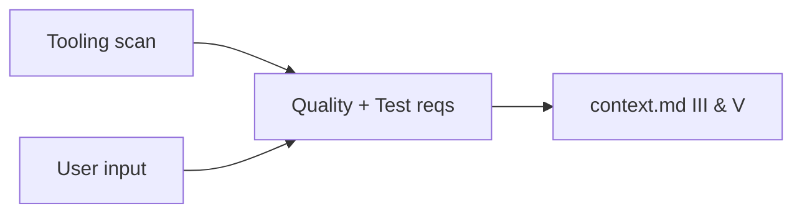

basic file: copilot/context.md in the target project

# Goal
- Define measurable quality + test requirements for the project.

# Phase 1 - Load
- Load `copilot/context.md` from the target project.
- Inspect existing tooling (linters, formatters, test frameworks, CI).

# Phase 2 - Interview
- Ask about: quality gates, coverage targets, test strategy (TDD), performance, security, maintainability.
- After a few questions - max 5. - ask the user if he wants to progress to phase 3 or in case you do not have more questions progress to phase 3.

# Phase 3 - Apply
Update these sections in `context.md` (see init skill):
- `III. Quality requirements`
- `V. Test requirements`

# Rules
- Requirements must be checkable (pass/fail).
- Reference tools instead of describing them.
- Keep it short, bullet points.

