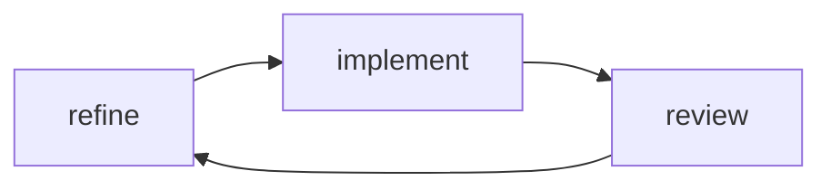
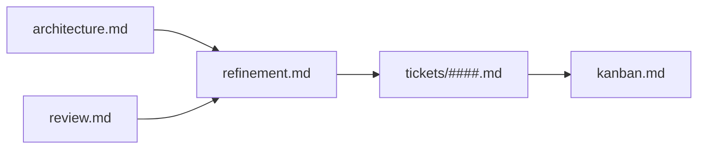

input: copilot/context.md, copilot/architecture.md, copilot/review.md (optional)
output: copilot/refinement.md, copilot/tickets/####.md, copilot/tickets/kanban.md

# Goal
- SDLC phase 3 (Refinement, Agile). Interactive.
- Turn architecture (+ review findings) into implementable tickets, split by module/unit.

# Phase 1 - Load
- Always load `copilot/context.md` first, then `copilot/architecture.md`.
- Load `copilot/review.md` if present (feed findings as `dept_####` tickets).

# Phase 2 - Scope
- If the scope is not clear ask the user on what (sub)-component to focus on. Can be more then one.

# Phase 3 - refinement.md
- Describe the concrete implementation idea per component (modules/units, test approach).
- Use `refinement.default.md` (this folder); see `refinement.example.md`.
- Use vertical slicing to define the tickets and slices 

# Phase 4 - Discuss with user
- Ask the user open questions. Discuss with the user question by question refine ideas and generate new ones. Do not ask all questions at once, but one by one, discuss each question and its answer before moving to the next one. Clarify Slices. Every few questions ask the user if he wants to progress to phase 4 or if he wants to continue refining with more questions.

# Phase 5 - Creation
- Create `copilot/refinement.md`
- One ticket per Unit/feature/fix. Small and self-contained.
- Files: `copilot/tickets/####.md`
- Use `ticket.default.md`; see `ticket.example.md`.
- Order tickets by execution order (Vertical slices).

# Phase 6 - Kanban
- generate kanban documentation by running `scripts/kanban.py` if it exists.
