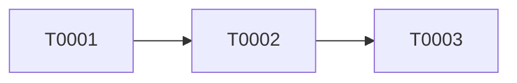

# Refinement

> Generated by the `refine` skill. Implementation plan per component.

## 1. Strategy
- Order of implementation, milestones, risks.

## 2. Per component
### <Component Name>
- Units to build/change.
- Classes, key methods, data structures.
- Test approach (TDD): list test cases.
- Related tickets: `####`, `####`.

## 3. Dependencies

## 4. Open questions
- Bullet list.

