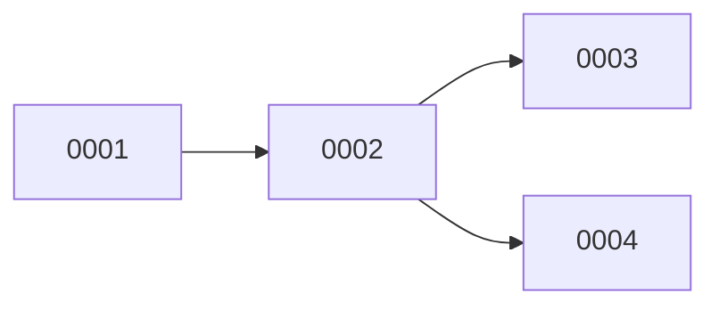

# Refinement

> Example: CLI note-taking app.

## 1. Strategy
- Build bottom-up: Storage -> NoteCore -> CLI.
- Milestone 1: add + list. Milestone 2: search.

## 2. Per component
### Storage
- Unit `FileRepository` implements `NoteRepository`.
- Methods: `save(Note)`, `loadAll()`.
- Tests: empty dir, one note, many notes, corrupt file.
- Tickets: `0001`.

### NoteCore
- Unit `NoteService`.
- Methods: `add`, `list`, `search`.
- Tests: add returns id, search hit/miss, empty store.
- Tickets: `0002`, `0003`.

### CLI
- ArgParser + Renderer.
- Tests: unknown command, missing arg.
- Tickets: `0004`.

## 3. Dependencies

## 4. Open questions
- Search: case sensitive? (assume no, confirm)

