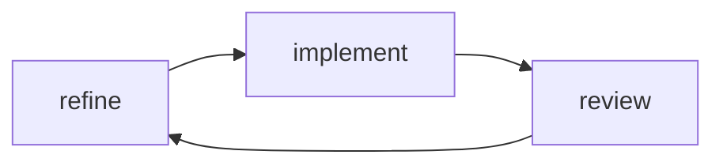

# Goal
- SDLC phase 5 (Review, Agile). Non-interactive.
- Find problems, bugs, gaps and contradictions; suggest architecture/refinement changes.

# Phase 1 - Load
- Always load `copilot/context.md` from the target project first, then `copilot/architecture.md` and `copilot/refinement.md`.
- Scan source, tests, quality config.

# Phase 2 - Review
- Focus on the Code and the Changes
- Check if the functions are implemented as defined compared to the project or given scope.
- Check for: correctness, consistency, gaps, duplication, missing tests, doc/code mismatch. Per `context.md`.

# Phase 3 - Write review.md
- Use `review.default.md` (this folder); see `review.example.md`.
- Rank findings by severity. Each finding: location, problem, suggestion.
- Mark items that should become `debt_####` tickets (not needed to fix to progress).
