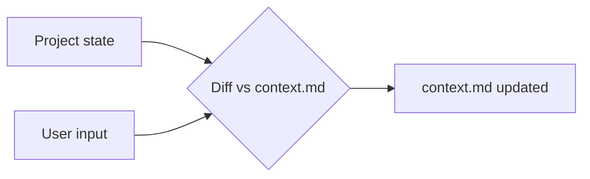

# Goal
- Keep `context.md` in sync with the real project state.

# Phase 1 - Load
- Load `copilot/context.md` from the target project (see init skill for section layout).

# Phase 2 - Interview
- Ask the user relentlessly about changes and new ideas: new/removed features, tech, quality, bugs, gaps, contradictions.
- After a few questions - max 5. - ask the user if he wants to progress to phase 3 or in case you do not have more questions progress to phase 3.

# Phase 3 - Apply
- Update affected sections only (I-IX, see init skill).
- Remove outdated info, mark open questions.

