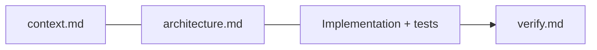
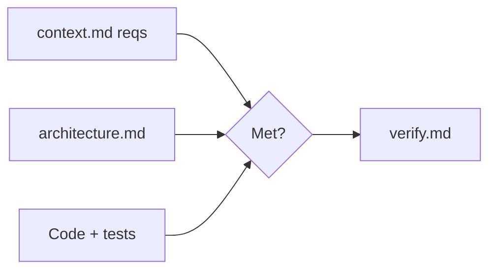

input: copilot/context.md, copilot/architecture.md, copilot/refinement.md, source code
output: copilot/verify.md

# Goal
- SDLC phase 6 (Verification, V-Model). Interactive (ask on ambiguity).
- Final check: does the software meet `context.md` requirements and follow architecture/refinement?

# Phase 1 - Load
- Always load `copilot/context.md` first, then `architecture.md`, `refinement.md`.

# Phase 2 - Verify

- Map each requirement/component to evidence (test, code, gate result).
- Run quality gates (build, lint, tests) and record results.
- Ask the user to clarify ambiguous or untestable requirements. Do not assume.

# Phase 3 - Write verify.md
- Use `verify.default.md` (this folder); see `verify.example.md`.
- Give a pass/fail per requirement + overall verdict.
- List deviations and suggested architecture/refinement changes.

# Next
- On deviations: hand findings back to `architect` / `refine`.

