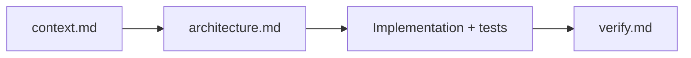

# Goal
- SDLC phase 6 (Verification, V-Model). Non-interactive service.
- Final check: does the software meet `context.md` requirements and follow architecture/refinement?

# Phase 1 - Load
- Always load `copilot/context.md` from the target project first, then `copilot/architecture.md` and `copilot/refinement.md`.

# Phase 2 - Verify
- Map each requirement/component to evidence (test, code, gate result).
- Run quality gates (build, lint, tests) and record results.
- Do not assume ambiguous or untestable requirements. Record them as open verification issues.

# Phase 3 - Write verify.md
- Use `verify.default.md` (this folder); see `verify.example.md`.
- Give a pass/fail per requirement + overall verdict.
- List deviations and suggested architecture/refinement changes.

# Next
- On deviations: hand findings back to `architect` / `refine`.

