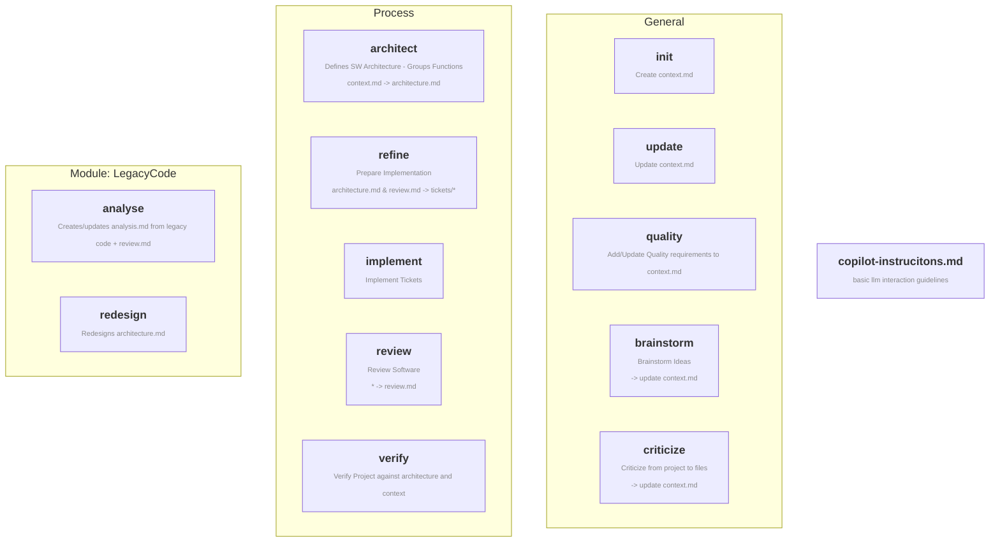
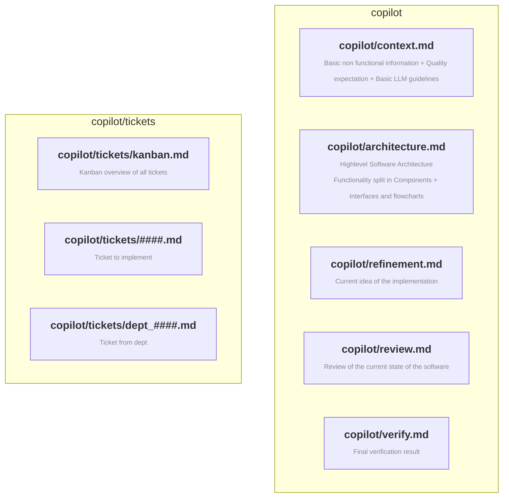
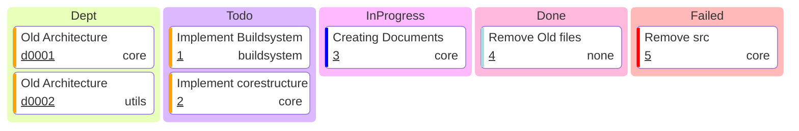

# Skills from an Software Engineering Manager

Hi im Maximilian, i currently work myself into the topics of LLM-Management/-Processes/-Quality/-Automation/-... and here you can find my latest public metafiles (skills) that i have created. These are made for copilot but you can use them with other tools and any model. 

I created these skills with the goal to be able to put into any current project, form new ideas to legacy code. They will focus on a simple and effective process while keeping LLM-Automation in mind. I will keep updating this repository with new skills and improvements to existing skills, so check back often.

If you are interested into the details of these skills and my thought process behind it check out my Youtube channel:  

## Mermaid
Install the mermaid plugin so you also get these nice diagrams, if they are not natively supported! Do not let the llm create ascii diagrams.

## Overview - Meta-Files
Note: All skills (But implementation/review) are interactive and might require user input while executing.

## Overview - Repository-Files

### Mermaid kanban example

The script scripts/kanban.py generates this mermaid overview from all tickets. The Agents should execute it after implement/refinement.

