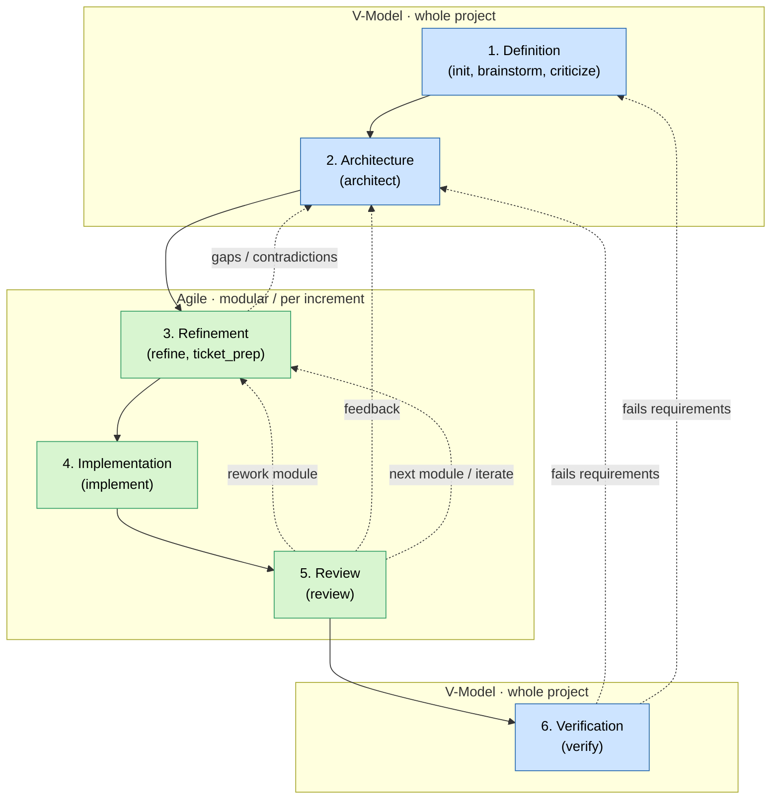
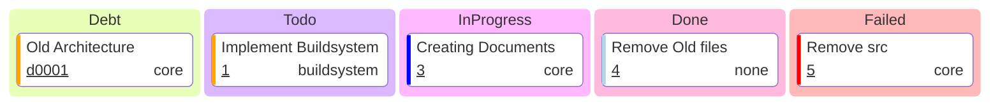

# Skills from an Engineer for Engineers

Hi, I am Maximilian. I'm a Senior Manager and focus on learning and sharing knowledge about LLMs/copilot.
I provide explanations and videos on my channel:

This repository contains public meta files for github-copilot. They are designed for new projects and legacy-code projects.

I heavily use Mermaid-capable Markdown rendering, so you might new a plugin in your local IDE.

## Skill map

| Skill         | Mode            | Purpose                                                  | Main output                                              |
|---------------|-----------------|----------------------------------------------------------|----------------------------------------------------------|
| `init`        | interactive     | Scan/interview and create project source-of-truth docs.  | `copilot/context.md`, `copilot/software_requirements.md` |
| `brainstorm`  | interactive     | Explore, rate and validate ideas with the user.          | updated `context.md` / `software_requirements.md`        |
| `criticize`   | interactive     | Find gaps, contradictions, risks and overengineering.    | updated `context.md` / `software_requirements.md`        |
| `architect`   | interactive     | Group functionality into components and interfaces.      | `copilot/architecture.md`                                |
| `analyse`     | interactive     | Reverse-engineer existing legacy code. Refactoring.      | `copilot/analysis.md`                                    |
| `redesign`    | interactive     | Convert legacy findings into target architecture.        | `copilot/architecture.md`                                |
| `refine`      | interactive     | Detail components into modules, units, data and tests.   | `copilot/refinement/component_*.md`                      |
| `ticket_prep` | interactive     | Split refined work into vertical implementation tickets. | `copilot/tickets/####.md`, `kanban.md`                   |
| `implement`   | non-interactive | Implement tickets and verify acceptance criteria.        | code, tests, ticket status, `kanban.md`                  |
| `review`      | non-interactive | Review code/changes against docs and quality rules.      | `copilot/review/review_*.md`                             |
| `verify`      | non-interactive | Verify requirements/components against evidence.         | `copilot/verify.md`                                      |

## VAgile process

This is the SDLC i try to replicate with the skills. It is a combination of the V-Model and Agile, which i call VAgile.

## Target project artifacts

| File                                | Purpose                                                  |
|-------------------------------------|----------------------------------------------------------|
| `copilot/context.md`                | project description, tech stack, quality rules, glossary |
| `copilot/software_requirements.md`  | requirements + behavior source of truth                  |
| `copilot/architecture.md`           | components, functionality, interfaces, diagrams          |
| `copilot/analysis.md`               | legacy architecture + risks                              |
| `copilot/refinement/component_*.md` | modules, units, data, tests                              |
| `copilot/tickets/####.md`           | implementation tickets                                   |
| `copilot/tickets/kanban.md`         | generated board                                          |
| `copilot/review/review_*.md`        | ranked findings                                          |
| `copilot/verify.md`                 | evidence, verdict, open tests                            |  
| `scripts/kanban.py`                 | generates the ticket board from tickets                  |

### Example kanban output format:

## Changes

- 13.06.2026 - Updated README to match current `copilot-instructions.md` and all skill metadata.
- 09.06.2026 - Split `context.md` into `context.md` + `software_requirements.md`; removed example files; removed update and quality skills; finalized SDLC.
